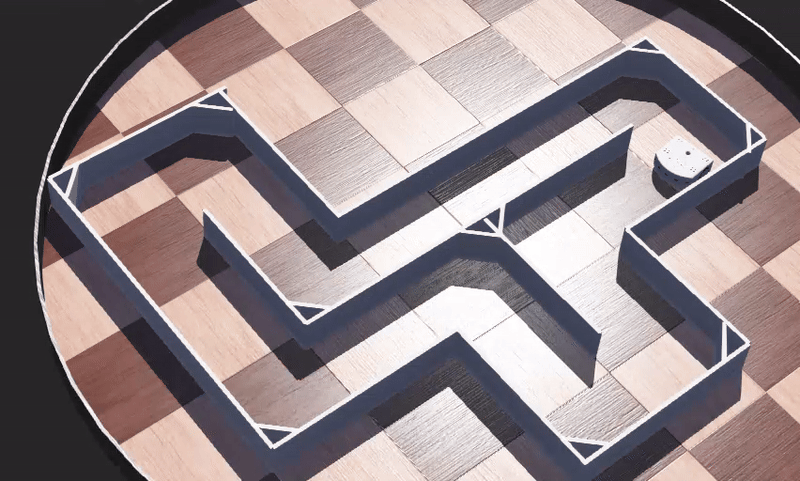
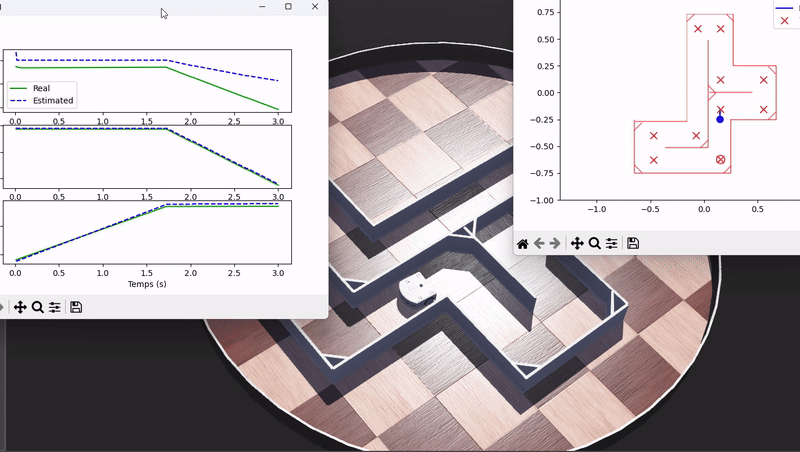
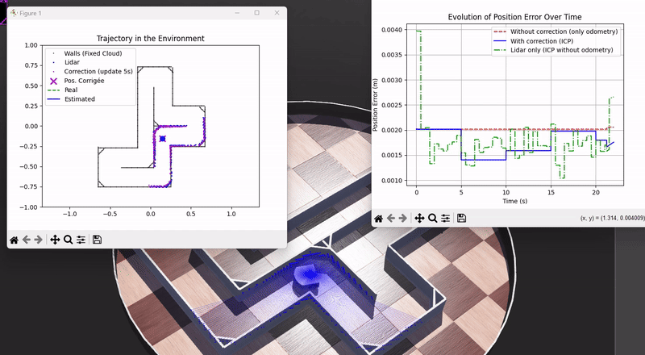
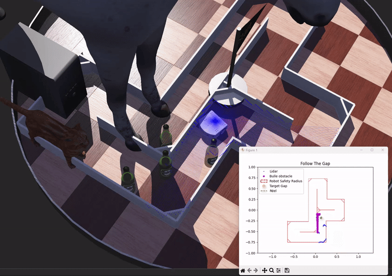

# Smart-robotics

Welcome to my **Smart Robotics** portfolio!

This repository gathers various student projects exploring the fundamentals of **autonomous mobile robotics**. Using the **Webots** simulator and the **Thymio II** robot, I implemented key algorithms ranging from basic kinematics to advanced reactive navigation.

Everything is coded in **Python**, leveraging libraries like `numpy` for math and `matplotlib` for real-time visualization.

---

## Project Breakdown & Skills Acquired

Here is a roadmap of the skills demonstrated in this repository:

### 1. Basics & Actuation (`TP1 - Navigation`)
*   **Goal**: Getting familiar with the robot's hardware abstraction layer.
*   **Skills**:
    *   Motor control (Open-loop).
    *   Reading sensor data.
    *   Basic discrete movements (Turn, Move).

### 2. Odometry & Kinematics (`TP2 - Odometrie`)
*   **Goal**: Estimating the robot's position `(x, y, θ)` solely based on wheel encoder data.
*   **Skills**:
    *   **Differential Drive Kinematics**: Implementing the math to convert wheel velocities into global pose updates.
    *   **Dead Reckoning**: Understanding drift and error accumulation over time.
    *   **Waypoint Navigation**: Creating a controller to visit a list of coordinates sequentially.
    *   **Visualization**: Real-time plotting of the estimated vs. real trajectory.
*   **Code**: `deplacements automatises.py` (Waypoint follower).

<!-- You can add a GIF here showing the robot following the red crosses on the plot -->
<!-- !Odometry Demo -->

### 3. Lidar Perception & Localization (`TP3 - Reprojection des donnees`)
*   **Goal**: Correcting odometry drift using environmental features (walls).
*   **Skills**:
    *   **Sensor Fusion**: Combining Odometry and Lidar data.
    *   **Coordinate Transformations**: Converting local Lidar scans to global map coordinates.
    *   **ICP (Iterative Closest Point)**: Implementing the SVD-based ICP algorithm from scratch to align sensor data with a known map.
    *   **Drift Correction**: Resetting the robot's estimated position when it matches the map.
*   **Code**: `partie2.py` (Full ICP implementation).

### 4. Reactive Navigation (`TP4 - Navigation`)
*   **Goal**: Navigating a complex environment without hitting obstacles, without a pre-planned path.
*   **Skills**:
    *   **Lidar Preprocessing**: Filtering noise and handling "Inf" values.
    *   **Follow The Gap Method**: Finding the largest safe opening in the Lidar scan and steering towards it.
    *   **Safety Bubble**: Implementing a dynamic safety radius to prevent corner collisions.
    *   **High-Speed Control**: Adjusting speed based on turn sharpness.
*   **Code**: `navigation.py`.

---

## Tech Stack
*   **Simulation**: Webots (Cyberbotics)
*   **Language**: Python 3
*   **Libraries**:
    *   `numpy` (Matrix operations, SVD)
    *   `matplotlib` (Real-time plotting & visualization)
    *   `scipy` (KDTree for nearest neighbor search in ICP)
